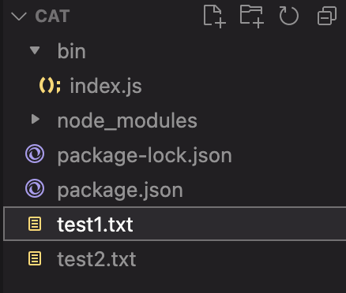
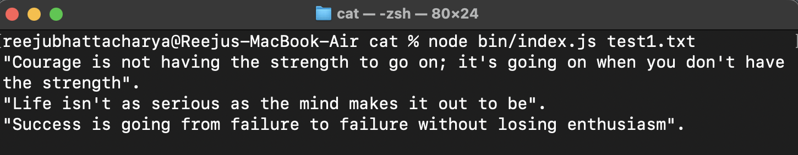
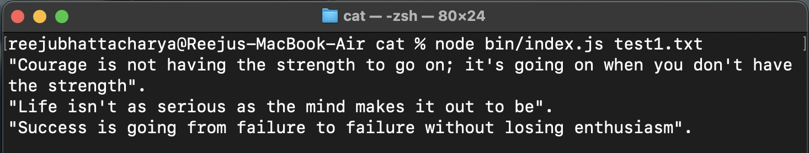
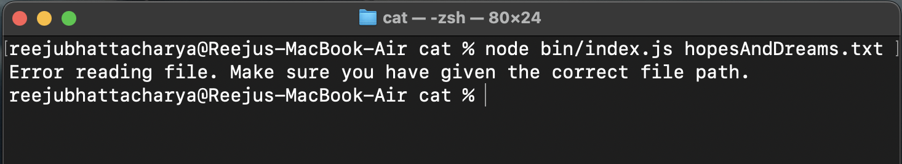
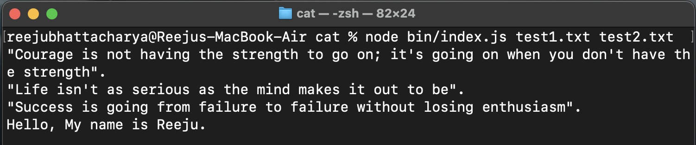
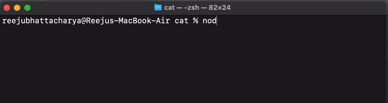
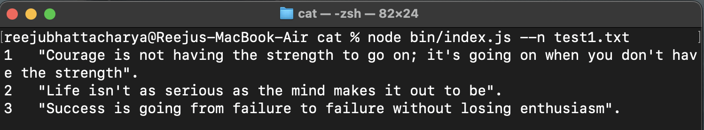
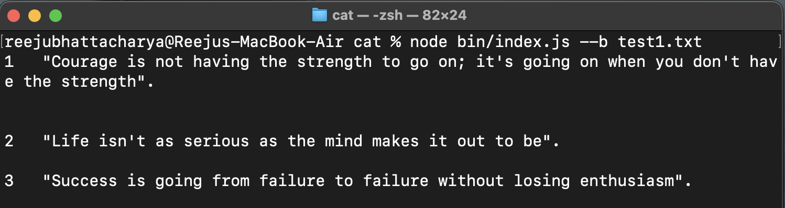

Command line utilities have always fascinated me because mostly they are quite simple to use, but still make you look really cool to someone not familiar to them. So, when I stumbled onto the [Coding Challenges](https://codingchallenges.fyi/) blog, which gave provides a fun challenge to recreate some of the ubiquitous command line utilities, I thought - "Why not?". So, this my "noob" implementation of the `cat` command using Node.js.

To the uninitiated, the `cat` command, as the name suggests, prints a picture of random cat to the terminal, like so:


Unfortunately, that was a lie, however desirable though it may be. The formal usage of the `cat` command is:

" `cat` is a standard [Unix utilitythat reads](https://en.wikipedia.org/wiki/Unix_utility) files sequentially, writing them to [standard output. The name is d](https://en.wikipedia.org/wiki/Standard_output)erived from its function to (con)**cat**enate files (from Latin *catenare*, "to chain")." - *Wikipedia*

I decided to implement 3 main features of the command:

1. print a single file content to standard output
    
2. concatenate multiple file contents and print them all to the standard output
    
3. implement the choice of line numbers through flags.
    

Without further ado, let's get started!

## Step 0: Setup

Firstly create a new directory where all the project files will be stored. Navigate to that directory through your terminal.

1. Set up a node.js project in your folder
```plaintext
npm init -y
```
2. Navigate to **package.json** and add a field for **type**. This tells Node.js to interpret JavaScript files in your project as ESM, allowing you to use modern import and export statements.
```json
 "type": "module",
```
3. Add another field as **main**. This specifies the entry point for your program.
```json
"main": "bin/index.js",
```
4. Create a directory **bin**. Inside it, add a file *index.js*. This file is where our code will lie.
   
5. Create two text files *test1.txt* and *test2.txt*. Add a few lines of text to each of them. I personally used quotes from ChatGPT.
   
Finally, your file structure should look something like this:



## Step 1: Print single file to standard output

In this step, we want to give the filepath of our text file as a command line argument to the execution command in the terminal and get the contents of the file printed to the terminal. It should look something like this:



### Setup the command line arguments
Since this is a command line utilty, we would need to pass the file name as an argument. Javascript does have inbuilt support for working command line arguments, but we are going to use a `yargs` library, for its simplicity and ease of use.

In the command line, import `yargs`.

```plaintext
npm install yargs
```
Navigate to the *index.js* file and import yargs

```javascript
import yargs from "yargs" // add to top
```

The next part is a bit complex but we are going to go over it step by step. Add the following code after your import statement.

```javascript
const argv = yargs(process.argv.slice(2))
    .usage("rcat [flags] <..files>")
    .options(options)
    .example("rcat -n text.txt", "Displays text.txt file with line numbers.")
    .help(true)
    .parse();
```
Now, let's break down what is mumbo-jumbo means:

1. `process.argv` returns an array of arguments passed to the CLI, the first two of which are the path to the *Node.js executable* and the path to the *Javascript file* being executed respectively. Elements begining from `process.argv[2]` comprise of the arguments that we passed during execution of the CLI. Thus, we are slicing our array and passing the user defined arguments to yargs.

2. `.usage` specifies the string to be displayed as an usage example when the user passes the *--help* argument.
   
3. `.options` takes an object as an argument, containing the flags which we want to support. We will get to that shortly.

4. `.example`, as the name suggests, gives an example implementation of how to use the CLI. It is displayed when the user passes the *--help* argument.

5. `.help(true)` allows the user to use the `--help` flag. It is already pre-setup by yargs for us. Bless them!

6. Finally, yargs parses all the arguments that we provided and gives us a helpful object containing all the information.

The `options` object is defined as follows. Add it before initializing `yargs`.

```javascript
const options = {
    "n" : {
        describe: 'Outputs line numbers',
        type: 'boolean'
    },
    "b" : {
        describe: 'Outputs line numbers on non-empty lines',
        type: 'boolean'
    }
}

// const argv = yargs(process.argv.slice(2))
// ....
```

`options` also allow you to add an alias to each flag, but I felt lazy and skipped it. 

### Add contents of file to string and print it

1. Since we are dealing with files, we shall put our trust on Javascript's handy `fs` library and import it at the top.

```javascript
import fs from "fs";  //add at the top
```

2. Our file path is stored in the `argv._` array. The `_` key stores all the arguments which do not have a defined flag. Therefore, `argv._[0]` should point to the filepath of our file.

```javascript
const filepath = argv._[0];
```

3. We will input our file data inside a `try-catch` block, since this is a piece of code prone to errors and we want to handle errors our own way.

```javascript
try { // add after .parse()
    const data = fs.readFileSync(filePath, 'utf8');
    console.log(data);
} catch (err) {
    console.error('Error reading file. You probably messed up.');
    process.exit(1);
}
```

In the above code, we simply read the file into `data` synchronously (since we dont care that our execution pauses before complete file read), and console.logging the data. In case of an error, we print out a less than helpful message to the user, in typical software engineering style. Pretty good work, I feel!

If things went well, this should be the output.



Let's check out our error handling capabilities too.



Looks like everything is in order. Onward ho!

## Step 2: Concatenate files and print to output

In this step, we aim to achieve a system where we can mention an arbitrary number of file paths and print all their contents to the standard output.

1. Since our `argv._` holds an array of all the unnamed arguments, if we simply loop over the values of the array, we will get all the filepaths passed to the command. 

```javascript
for (let i = 0; i < argv._.length; i++) {
        concatFile(argv._[i]);
    }
```

2. The `concatFile()` function is defined as follows:
   
```javascript
const concatFile = (filePath) => {
    try {
        const data = fs.readFileSync(filePath, 'utf8');
        console.log(data);
    } catch (err) {
        console.error('Error reading file. Make sure you have given the correct file path.');
        process.exit(1);
    }
}
```

Let's test it out. We can use our second test file that we created during the start of our project.



Looks to be working quite nicely. I thing we are qualified to call ourselves Senior Software Engineers now, to be fair....

## Step 3: Accomodate no arguments passed

When no arguments are passed to `cat`, or a single `-` is passed, `cat` reads from standard input and prints it to standard output. In this step, we plan to implement this feature.

1. We are going to wield Javascript's `readline` module to read data from the input stream one line at a time. So, we can go ahead and import that module

```javascript
import readline from "readline";
```

2. We want to execute our code for no arguments, when the length of the `argv._` array is 0, or it only contains `-`.
   
```javascript
if (argv._.length == 0 
    || (argv._.length == 1 && argv._[0] === '-')) {
    
    // do weird stuff
} else {
    // code for when user passes arguments
}
```

3. Initialize a `readline` interface with input and output.
   
```javascript
var rl = readline.createInterface({
        input: process.stdin,
        output: process.stdout
    });
```

4. We will define a function `listen()` which waits for an input from the user, and when the user presses Enter after typing something out, prints out the input and waits for a new input again. Naturally, this is a recursive function, and the exit condition from this recursion is when the user inputs the key **quit()**. We are using the `.question()` method of `readline`, with our question being an empty string.

```javascript
const listen = () =>  {
    rl.question('', input => {
        if (input == 'quit()')
            return rl.close();

        console.log(input);
        listen();
    });
}

    listen();
//} else {
```
If we didn't mess up, it should look something like this:


## Step 4: Add line numbers to each newline

A handy functionality that `cat` provides is prefixing line numbers to each new line in our output. Let's try to add that feature to our implementation.

1. Firstly, we will set up a variable `output`, to which we will concatenate all our formatted data before printing it out. Also, we will maintain a line_number variable for incrementing the line number at each line.
   
```javascript
let output = "";
let line_no = 1;
```

2. Let's create a new function `formatData()` which takes the raw data from the file and works it's magic to return a nice line-numbered output.
   
```javascript
const formatData = (data) => {
    // do stuff
    
    // return stuff
}
```

3. We will split the string into seperate lines using Javascript's `split()` method. Then, for each element in the list, we are printing that line along with their line numbers, incrementing the `line_no` variable along with it. This only happens if the user has given the `--n` flag along with the command, in which case `argv.n` will be `true`. Otherwise, `argv.n` will be null, which evaluates to `false`.

```javascript
const quotes = data.split("\n"); // array of quotes
quotes.forEach(q => {
    if(argv.n) {
        output += `${line_no++}   ${q} \n`;
    } else {
        output += `${q} \n`;
    }
}):

console.log(output);
```

Let's test out our sorcery, and see if everything is as expected.



## Step 5: Line numbers excluding non-blank lines

The final feature we will add to our CLI is to number the lines, but skip the empty ones. This will be activated with the `b` flag.

1. We need to modify the `forEach` loop in our `formatData` function to accomodate our new feature, as follows. The first `if` statement resolves to `true` when `argv.b` is not `null` and the current line in our data is empty, thus simply outputting a new line without line numbers. Otherwise, we will check if either the `n` or `b` flags are present, and if so, output a line-numbered line. Else, if no flag is given, we shall simply print out the line as it is.

```javascript
qoutes.forEach(q => {   // replace previous forEach 
    if (argv.b && q.trim().length == 0) {
        output += "\n";
    } else if (argv.n || argv.b) {
        output += `${line_no++}   ${q} \n`;
    } else {
        output += `${q}\n`;
    }
});
```

Let's do a final test to see if it works. Before testing it out, add some blank lines in your test files, to see the `b` flag in action.



## Bonus Step: Making it a global CLI

Till now, we have been able to access our CLI only via node, and only in our project directory. Well, that's not cool enough for me. I want to be able to call my CLI from any directory, without node. 

1. Go to *package.json* and add a field **bin**. The **rcat** here is the command to access our CLI, simillar to **cat**.

```json
"bin": {
    "rcat": "./bin/index.js"
  }
```

2. Now, while in the root directory in the terminal, run the following command. The -g installs the CLI globally.
   
```plaintext
npm install -g .
```

**And we are done.**

Congratultions for bearing with my blabbering so far (I couldn't have done it..). I want to give a full disclaimer that I am, by no means, an experienced developer and my code, by no means, is anything but garbage. This is simply my attempt to learn about Command Line Applications and have some fun along the way.

Hope you liked it, and let me know your thoughts in the comments below!

Catch you on the next one! Tata 


